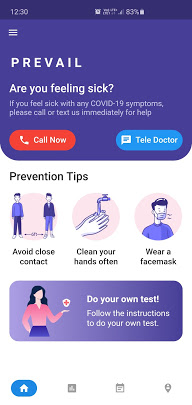
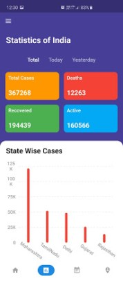
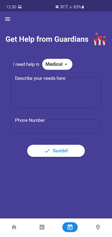

# Prevail

PREVAIL is an initiative by a group of engineering students from Sri Sairam Engineering College, Chennai which is based on the idealogy of "India fights Corona". Feeling sick? Skeptical about affected by corona? Don't worry, PREVAIL helps you contact a doctor bot or the government helpline numbers which elucidate your current health status.

The app provides detailed statistics on the currently active, recovered, and death cases in India and also at a regional level (top 5 states that are most infected) in an intuitive UI, which makes it to apparent to any user. The PREVAIL team believes in “To us, all towns are one, all men our kin”, and so we help in forming an open community (PREVAIL COMMUNITY) in which anyone could be a 
volunteer (GUARDIAN) and also individuals in need of help. Users can post their needs under four category Medical, Food, Shelter and Other. Whatever may be your need we got your back and together we can PREVAIL this current crisis.#staysafe #stayhome

Download the latest APK from [here](https://github.com/VasanthKumar14/PREVAIL-APP/releases/download/v1.0.0%2B1/app-release.apk) to install the application.

<td align="center"></td>  
<h3>
Free Demo</h3>  
  

 <h3>
Screenshots</h3>

|               Landing Page                |            Covid19 Trends            |                Get Help                |              Join to Help              |
| :---------------------------------------: | :----------------------------------: | :------------------------------------: | :------------------------------------: |
|  |  |  |  |

One can Download the app from the link provided above . It helps in taking self assessment and provides constant updates and information . All information are provided are valid and updated regularly . It also helps in connecting needy people and the guardians who are ready to help people.

# Features

1. Can call directly to the government help line numbers through the app just by a single tap.
2. Can be used for self assesment through the Doctor bot and even consult doctors for guidance if needed .
3. Can request for help through the app to our Guardians .
4. Can join the team of Guardians(volunteers) to help people.
5. Google authentication to make things simple and secure .
6. Material UI which gives a Simple and Rich look .

# Contributors

|  |  |  |  |
| :-----------------------------------------------------------------------------------------------------------------------------------------------------------------------------------------------: | :-----------------------------------------------------------------------------------------------------------------------------------------------------------------------------------------------: | :-----------------------------------------------------------------------------------------------------------------------------------------------------------------------------------------------: | :-----------------------------------------------------------------------------------------------------------------------------------------------------------------------------------------------: |
|                                                              <a href="https://www.linkedin.com/in/sy-d"  target="_blank">Dinesh</a>                                                               |                                                 <a target="_blank" href="https://www.linkedin.com/in/vasanth-kumar-967810169/">Vasanth Kumar</a>                                                  |                                                      <a  target="_blank" href="https://www.linkedin.com/in/hemachandranvk/">Hemachandran</a>                                                      |                                                     <a  target="_blank" href="https://www.linkedin.com/in/surender-t-52b8b8183/">Surender</a>                                                     |

<h3 align="center" style="width: 100%;text-align:center">of <b>Sri Sairam Engineering College, Chennai</b>.
